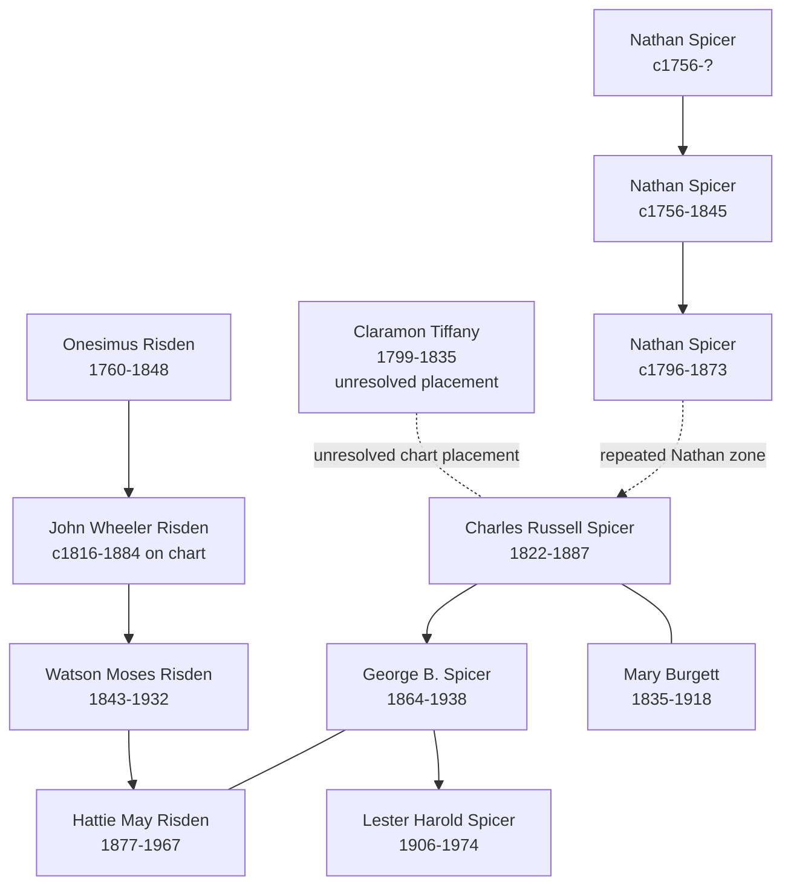

# Spicer and Risden Branch Summary

The Spicer pedigree timeline cleanup tightened this branch in one important way: the later Charles-to-George-to-Lester line is solid branch navigation, while the earlier repeated-`Nathan Spicer` segment still needs to remain openly unresolved.

## Branch Diagram

## What We Know

- The later line from [[People/Charles Russell Spicer|Charles Russell Spicer]] to [[People/George B Spicer|George B. Spicer]] to [[People/Lester Harold Spicer|Lester Harold Spicer]] is clear on the chart.
- [[People/Mary Burgett|Mary Burgett]] is clearly the Burgett-side spouse attached to the Charles Russell Spicer generation.
- The Risden collateral line clearly reaches [[People/Watson Moses Risden|Watson Moses Risden]] and [[People/Hattie May Risden|Hattie May Risden]].

## What Remains Uncertain

- The repeated-`Nathan Spicer` sequence between the 1796-1873 Nathan and Charles Russell Spicer remains unresolved.
- `Claramon Tiffany` is not a safe resolved spouse placement from the chart alone.
- [[People/John Wheeler Risden|John Wheeler Risden]] remains a chart-versus-vault date conflict case.

## Sources

1. [[spicer-pedigree-timeline-index|Spicer Pedigree Timeline Extraction Index]]
2. [[References/Shared Intake 2026-04-22 Pedigree Timeline Spicer|Shared Intake 2026-04-22 Pedigree Timeline Spicer]]
3. [[References/Shared Intake 2026-04-22 Spicer Lineage Note|Spicer Lineage Note]]
4. [[References/Shared Intake 2026-04-22 Burial Sites Summary|Burial Sites Summary]]
5. [[People/Nathan Spicer|Nathan Spicer]]
6. [[People/Charles Russell Spicer|Charles Russell Spicer]]
7. [[People/George B Spicer|George B. Spicer]]
8. [[People/Hattie May Risden|Hattie May Risden]]
9. [[People/Watson Moses Risden|Watson Moses Risden]]
10. [[People/Mary Burgett|Mary Burgett]]
