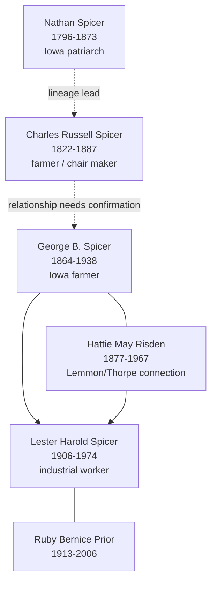

# Spicer and Risden Branch Summary

This branch follows an Iowa-centered Spicer family story from nineteenth-century farming households into twentieth-century industrial work. It is one of the most visitor-ready parts of the vault because several profiles already include repeated census households, burial-site notes, and compact family diagrams.

## Branch Diagram

Dashed arrows mark lineage links that are useful for navigation but still need direct record confirmation.

## Start With These People

- [[People/Nathan Spicer|Nathan Spicer]] - early Spicer patriarch documented in 1850-1870 Iowa census households and burial-site notes.
- [[People/Charles Russell Spicer|Charles Russell Spicer]] - bridge-generation Spicer profile with census households from 1850-1880.
- [[People/George B Spicer|George B. Spicer]] - Iowa farmer and household head whose page anchors the later Spicer family.
- [[People/Hattie May Risden|Hattie May Risden]] - connects the Spicer story back to the Lemmon/Thorpe branch.
- [[People/Lester Harold Spicer|Lester Harold Spicer]] and [[People/Ruby Bernice Prior|Ruby Bernice Prior]] - later-generation couple linking the Spicer and Prior lines.

## What We Know

- [[People/Nathan Spicer|Nathan Spicer]] appears across 1850, 1860, and 1870 Iowa census summaries, moving from a blacksmith-related household to dependent residence with family.
- [[People/George B Spicer|George B. Spicer]] is documented as a child or young adult in 1870 and 1880, then as a household head with [[People/Hattie May Risden|Hattie May Risden]] in 1900-1920.
- [[People/Lester Harold Spicer|Lester Harold Spicer]] is tracked from child in George and Hattie's farming household to railroad and manufacturing work in Cedar Rapids.
- The Spicer/Spooner and Spring Grove cemetery entries provide burial context for several members of this branch.

## What Remains Uncertain

- The exact Nathan-to-Charles-to-George relationship chain remains a research gap on the person pages and should not be treated as fully proved.
- Some census extracts contain OCR or compiler ambiguity, especially around household relationships and name forms.
- The Ruby Bernice Prior connection is source-backed by staged lineage, census summaries, the Prior timeline, and burial notes, but her page still flags parentage correlation as an open task.

## Sources

1. [[People/Nathan Spicer|Nathan Spicer]]
2. [[People/Charles Russell Spicer|Charles Russell Spicer]]
3. [[People/George B Spicer|George B. Spicer]]
4. [[People/Hattie May Risden|Hattie May Risden]]
5. [[People/Lester Harold Spicer|Lester Harold Spicer]]
6. [[People/Ruby Bernice Prior|Ruby Bernice Prior]]
7. [[References/Shared Intake 2026-04-24 Census InDesign Summaries|Census InDesign Summaries]]
8. [[References/Shared Intake 2026-04-22 Burial Sites Summary|Burial Sites Summary]]
9. [[References/Shared Intake 2026-04-22 Spicer Lineage Note|Spicer Lineage Note]]
