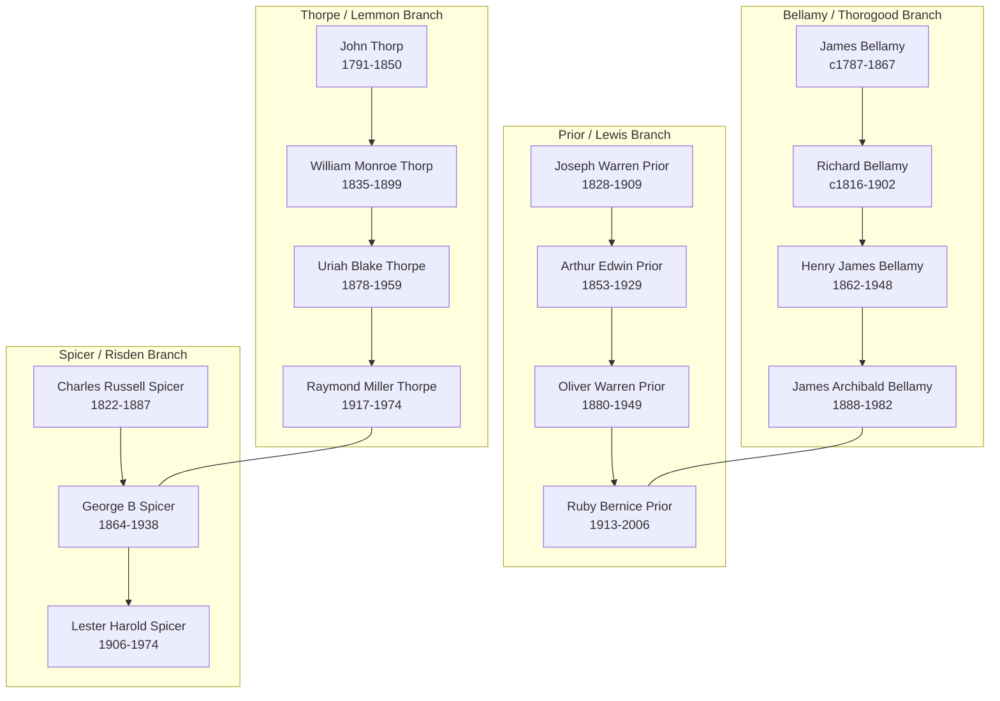

# Thorpe Pedigree Timelines

This page tracks the pedigree timeline files provided by [[People/Robert Butch Thorpe|Robert "Butch" Thorpe]] and the processed indexes built from their PDF exports.

## Files Provided

- `References/raw/PedigreeTimelines2025.cdr`
- `References/raw/PedigreeTimelines2019Descendants2.cdr`

## Processed Timeline Indexes

- [[References/raw/processed/2026-04-22-intake/pedigree-timeline/thorpe-pedigree-timeline-index|Thorpe Pedigree Timeline Extraction Index]]
- [[References/raw/processed/2026-04-22-intake/pedigree-timeline/bellamy-pedigree-timeline-index|Bellamy Pedigree Timeline Extraction Index]]
- [[References/raw/processed/2026-04-22-intake/pedigree-timeline/prior-pedigree-timeline-index|Prior Pedigree Timeline Extraction Index]]
- [[References/raw/processed/2026-04-22-intake/pedigree-timeline/spicer-pedigree-timeline-index|Spicer Pedigree Timeline Extraction Index]]

## Public Intake Notes

- [[References/Shared Intake 2026-04-22 Pedigree Timeline Thorpe|Thorpe]]
- [[References/Shared Intake 2026-04-22 Pedigree Timeline Bellamy|Bellamy]]
- [[References/Shared Intake 2026-04-22 Pedigree Timeline Prior|Prior]]
- [[References/Shared Intake 2026-04-22 Pedigree Timeline Spicer|Spicer]]

## Butch's Notes on How to Read the Timelines

Per [[References/Butch Thorpe Email|Butch's email]]:

- Horizontal bars represent ancestor lifespans.
- Red dots indicate official records.
- Numbers by red dots refer to Butch's personal record copies.
- Blue dots indicate census records corresponding to the date marked by vertical lines.
- The charts show selected early generations that fit on each page, not all ancestors with records.
## Current Working Status

- **SVG Extraction Complete**: The high-resolution `.xhtml` exports have been programmatically parsed (2026-04-30). 
- **Automated Enrichement**: Individual lifespan snippets and source indicators (Census, Certificates, Obituaries) have been injected into all relevant person pages.
- **Reference Numbers**: Butch's personal record reference numbers (e.g., #052, #250) have been extracted and linked to individuals.

## Master Pedigree Overview

The following diagram summarizes the convergence of the four main branches documented in the pedigree timelines.

## Record-Reference Leads

### Thorpe / Lemmon / Tallman / Ault

- The Thorpe chart clearly carries `John Thorp 1791-1850` -> `William Monroe Thorp 1835-1899` -> `Uriah Blake Thorpe 1878-1959` -> `Raymond Miller Thorpe 1917-1974`.
- It also visibly places `Jane Wager/Jennie Dodge`, `Sarah Annett Lemmon`, and `Lenore Hetty Tallman` in the same direct-line context.

### Bellamy / Kelly / Emblow / Munson / Thorogood / Sorrell

- The Bellamy chart clearly carries the later line `James Bellamy c1787-1867` -> `Richard Bellamy c1816-1902` -> `Henry James Bellamy 1862-1948` -> `James Archibald Bellamy 1888-1982`.
- The earliest Bellamy overlap above James remains unresolved.
- The same chart provides useful collateral placement for Kelly, Emblow, Munson, Thorogood, and Sorrell pages already in the vault.

### Prior / Lewis / Palmer / Bangle

- The Prior chart clearly carries `Joseph Warren Washington Prior 1828-1909` -> `Arthur Edwin Prior 1853-1929` -> `Oliver Warren Prior 1880-1949` -> `Ruby Bernice Prior 1913-2006`.
- It also ties `Martha Eliza Lewis` into the direct Prior chain and shows `May Aleen Palmer` as the later spouse line.
- `Oliver Elhanon Lewis`, `Elizabeth Quackenbush`, and the Bangle line remain compiled-chart collateral rather than fully reconciled proof.

### Spicer / Risden / Burgett

- The Spicer chart clearly supports the later chain `Charles Russell Spicer 1822-1887` -> `George B Spicer 1864-1938` -> `Lester Harold Spicer 1906-1974`.
- The earlier repeated-`Nathan Spicer` segment and `Claramon Tiffany` placement remain unresolved and should stay marked that way.
- The same chart provides a clear Risden side line from `Onesimus Risden` to `Hattie May Risden`.

## Main Discrepancy Candidates

| Person | Timeline reading | Other vault evidence | Current handling |
|---|---|---|---|
| [[People/Arthur Edwin Prior|Arthur Edwin Prior]] | `1853-1929` | Some local census-summary treatment uses `1851-1929` | Keep birth year open. |
| [[People/Elizabeth A Quackenbush|Elizabeth A Quackenbush]] | `c1841-1909` | Existing page uses `c1836-1909` | Keep as unresolved discrepancy. |
| [[People/John Wheeler Risden|John Wheeler Risden]] | `c1816-1884` | Existing local notes use different dates | Keep as unresolved discrepancy. |
| [[People/James Kelly|James Kelly]] | `c1828-before 1881?` with `Sarah Barton?` | Parish and census material point elsewhere | Treat chart as compiled lead, not resolution. |
| `Claramon Tiffany` placement | Repeated-Nathan zone in the Spicer chart | Existing pages previously flattened this into a spouse claim | Keep unresolved. |

## Record-Reference Leads

- The processed indexes preserve chart-only marker systems such as numbered record references, `CD` tags, burial markers, obituary markers, and alphanumeric IDs.
- These remain research leads only until tied back to stronger local source material.
