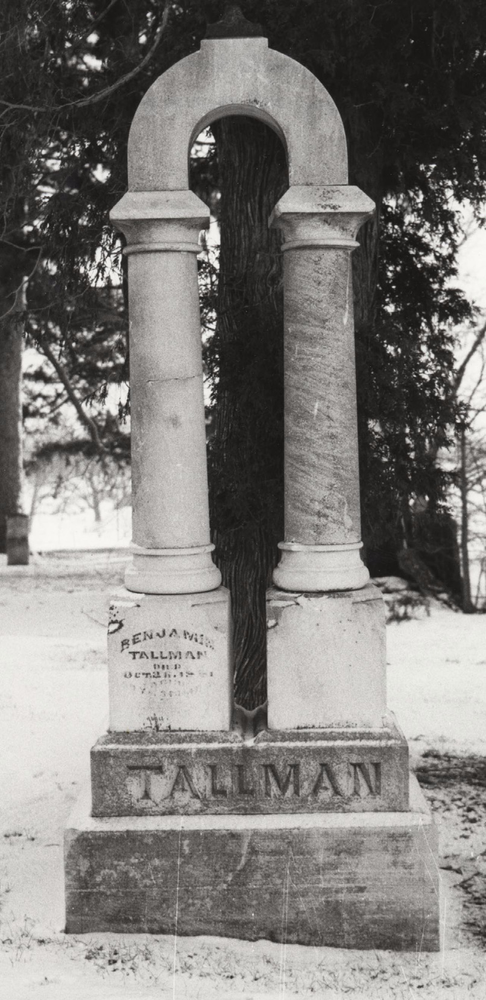

# Thorpe Family History

This site is an interactive modernization of the Thorpe family research meticulously compiled by [[People/Robert Butch Thorpe|Robert "Butch" Thorpe]] as a gift to his descendants. It follows the **[[Topics/The Living Legacy|Living Legacy]]** of the Thorpe line through its convergence with the Lemmon, Blake, Spicer, Risden, Palmer, Prior, Lewis, Ault, and Tallman families.

The best way to begin is with one of the branch stories below. Each branch page gives a plain-language overview, a compact family diagram, links to the strongest person profiles, and a short list of what still needs verification.

## Start With a Family Branch

| Branch | What to expect |
|--------|----------------|
| [[Topics/Lemmon Blake Thorpe Branch Summary|Lemmon, Blake, and Thorpe]] | The core Thorpe-connected branch context from the compiled pedigree timeline, including the two separate Uriah Blake identities and the Sarah Annett Lemmon bridge into the Thorpe line. |
| [[Topics/Spicer Risden Branch Summary|Spicer and Risden]] | An Iowa farming line from [[People/Nathan Spicer|Nathan Spicer]] through [[People/George B Spicer|George B. Spicer]], [[People/Hattie May Risden|Hattie May Risden]], and [[People/Lester Harold Spicer|Lester Harold Spicer]]. |
| [[Topics/Palmer Prior Lewis Branch Summary|Palmer, Prior, and Lewis]] | A migration story from Wisconsin and Minnesota into Iowa, connecting [[People/Wynat Lewis|Wynant Williamson Lewis]], [[People/Martha Eliza Lewis|Martha Eliza Lewis]], [[People/May Aleen Palmer|May Aleen Palmer]], and the Prior family. |
| [[Topics/Ault Tallman Branch Summary|Ault and Tallman]] | Ohio-to-Iowa household records for the Ault and Tallman families, including [[People/Elizabeth Plomey Ault|Elizabeth Plomey Ault]], [[People/Miller Mathias Tallman|Miller Mathias Tallman]], [[People/Benjamin B Tallman|Benjamin B Tallman]], and [[People/Romancy Miller|Romancy Miller]]. |

## Explore by Need

- **Find a person:** Use the [[People Directory|People Directory]] for the full alphabetical list.
- **Read the family stories:** Explore the **[[Topics/The Living Legacy|Living Legacy]]** and other [[Topics/Family Stories and Biographies|Family Stories]] for narrative accounts of ancestor lives.
- **Understand the visuals:** Read the [[Topics/Visual Legend|Visual Legend for Pedigree Timelines]] to understand the color-coded dots and icons used on person profiles.
- **See who lived when:** Visit the [[Topics/Chronological Portal|Chronological Portal]] to explore overlapping lifespans and era-based timelines.
- **Search by topic or source:** Use the [[Search Index|Search Index]].
- **See the source trail:** Start with [[References/Butch Thorpe Email|Butch Thorpe Email]], [[Topics/Thorpe Pedigree Timelines|Thorpe Pedigree Timelines]], and [[References/Shared Intake 2026-04-24 Census InDesign Summaries|Census InDesign Summaries]].

## Site Progress

The current vault documents over 120 people and includes census extracts, burial-site notes, and compiled pedigree timelines. As of April 30, 2026, the site features **automated SVG timeline snippets** for all individuals extracted from the original CorelDRAW diagrams, providing a visual-first view of their records and lifespans.
- **Follow recent work:** Read the [[CHANGELOG|Changelog]] for completed reconciliations, newly enriched profiles, and publishing notes.

## What This Site Is

This is a research wiki, not a finished family book. Some pages are well supported by census summaries, burial records, and pedigree timeline exports; other pages are still placeholders for future verification. When the evidence is uncertain, the page should say so.

The current vault documents 111 people and includes census extracts, burial-site notes, compiled pedigree timelines, and references to 31 genealogical or historical book extracts. The strongest visitor-ready pages are linked from the branch summaries above.
ove.
